# Image Processing: CPU vs CUDA

A comparative study of classic image-processing algorithms implemented twice: **multithreaded C++** on the CPU and **CUDA** on the GPU. The project accompanies coursework on computer architecture (Belarusian State University of Informatics and Radioelectronics) comparing **AMD Ryzen 5 5600** CPU performance against **NVIDIA GeForce RTX 3050 Ti** GPU acceleration using resolutions **2500×2500**, **6800×6800**, and **15000×15000**.

---

## Table of contents

- [Overview](#overview)
- [Features](#features)
- [Repository layout](#repository-layout)
- [Requirements](#requirements)
- [Build](#build)
- [Algorithms](#algorithms)
- [Benchmark methodology](#benchmark-methodology)
- [Results](#results)
- [Visual demo](#visual-demo)

---

## Overview

Each algorithm ships as a **standalone executable**: one variant compiled with `g++` (`*_cpu`) and one with `nvcc` (`*_cuda`). Images are loaded and saved through **stb_image** / **stb_image_write** ([`lib/`](lib/)) as **RGB**, 8 bits per channel.

On the **CPU**, workloads are split across rows using `std::thread` and `std::thread::hardware_concurrency()`. On the **GPU**, pixel-wise or tile-friendly kernels run on a 2D CUDA grid; measured GPU time includes allocation, **host→device** copy, kernel execution, and **device→host** copy back (as described in the report).

---

## Features

| Algorithm | CPU source | CUDA source | Typical GPU benefit |
|-----------|------------|-------------|---------------------|
| Grayscale (BT.709 luma) | [`greyscale_cpu.cpp`](src/greyscale/greyscale_cpu.cpp) | [`greyscale_gpu.cu`](src/greyscale/greyscale_gpu.cu) | Low or negative (memory-bound) |
| Pixelize (block average) | [`pixelize_cpu.cpp`](src/pixelize/pixelize_cpu.cpp) | [`pixelize_gpu.cu`](src/pixelize/pixelize_gpu.cu) | Mixed (small images OK; large often slower on GPU in tests) |
| Median blur | [`median_blur_cpu.cpp`](src/median_blur/median_blur_cpu.cpp) | [`median_blur_gpu.cu`](src/median_blur/median_blur_gpu.cu) | Very high |
| Rotate (bilinear, center) | [`rotate_cpu.cpp`](src/rotate/rotate_cpu.cpp) | [`rotate_gpu.cu`](src/rotate/rotate_gpu.cu) | Mixed (good small / poor large in tests) |
| Unsharp mask | [`unsharp_mask_cpu.cpp`](src/unsharp_mask/unsharp_mask_cpu.cpp) | [`unsharp_mask_gpu.cu`](src/unsharp_mask/unsharp_mask_gpu.cu) | High |
| Canny edge detector | [`canny_edge_detector_cpu.cpp`](src/canny_edge_detector/canny_edge_detector_cpu.cpp) | [`canny_edge_detector_gpu.cu`](src/canny_edge_detector/canny_edge_detector_gpu.cu) | High |
| KNN denoising | [`knn_de_noising_cpu.cpp`](src/knn_de_noising/knn_de_noising_cpu.cpp) | [`knn_de_noising_gpu.cu`](src/knn_de_noising/knn_de_noising_gpu.cu) | Very high |

---

## Repository layout

| Path | Role |
|------|------|
| [`src/<algorithm>/`](src/) | Algorithm-specific `.cpp` / `.cu` entry points |
| [`src/utils/image_utils.{h,cpp}`](src/utils/image_utils.cpp) | Load/save helpers (`Pixel`, RGB vectors) |
| [`lib/stb_image.h`](lib/stb_image.h), [`lib/stb_image_write.h`](lib/stb_image_write.h) | Image I/O |
| [`Makefile`](Makefile) | Builds all targets into `build/` |

---

## Requirements

- **C++17** compiler (**g++** recommended).
- **CUDA Toolkit** with **nvcc** for GPU targets (optional if you only build CPU).
- **NVIDIA GPU + driver** matching your toolkit when running `*_cuda` binaries.
- **POSIX-like** environment; GPU link line uses `-lstdc++fs` as in the [`Makefile`](Makefile).

---

## Build

From the repository root:

```bash
make          # all CPU + GPU targets (needs nvcc)
make cpu      # CPU-only executables
make gpu      # GPU-only executables
make clean    # remove build/
make help     # short usage summary
```

Executables are written to **`build/`**, for example `build/greyscale_cpu` and `build/greyscale_cuda`.

---

## Algorithms

### Grayscale

Per-pixel **BT.709** luma: `Y = 0.2126 R + 0.7152 G + 0.0722 B`, replicated to RGB channels. CPU version parallelizes over row ranges; GPU uses a 2D kernel with **16×16** blocks ([`greyscale_gpu.cu`](src/greyscale/greyscale_gpu.cu)). Complexity **O(WH)**.

### Pixelize

Splits the image into **non-overlapping blocks** and fills each block with the mean RGB color of its pixels. CPU assigns horizontal strips of block-rows to threads. Complexity **O(WH)** per block size.

### Median blur

Per-pixel **per-channel median** over a square kernel (odd size); borders use clamped reads. CPU parallelizes rows; GPU implements the same filter with shared-memory friendly access patterns in [`median_blur_gpu.cu`](src/median_blur/median_blur_gpu.cu). Complexity roughly **O(WH · k²)** for kernel edge **k**.

### Rotate

**Inverse mapping**: for each destination pixel, sample the source with **bilinear interpolation** around the image center. Background uses black pixels outside the source. CPU threads handle row spans; GPU launches per-pixel threads. Complexity **O(WH)** with constant interpolation cost.

### Unsharp mask

Gaussian blur (radius → discrete kernel size **2r+1**) minus original gives a high-frequency mask; output is `original + amount × mask` with clamping. Three parallel passes on CPU (blur, mask, sharpen); analogous stages on GPU.

### Canny edge detector (CPU/GPU pipeline)

1. Convert RGB to grayscale (**ITU-R BT.601** weights `0.299 R + 0.587 G + 0.114 B` inside the Canny pipeline — **different** from the standalone grayscale tool above).
2. Gaussian smoothing with configurable σ and kernel size.
3. **Sobel** gradients, magnitude and angle.
4. **Non-maximum suppression** along gradient direction.
5. **Single-threshold** binarization to 8-bit edges.

### KNN denoising

For each interior pixel, patches in a search window are compared using mean squared RGB difference; the **K** nearest patches (plus the center pixel) are averaged. CPU parallelizes over rows; GPU port parallelizes the heavy inner search ([`knn_de_noising_gpu.cu`](src/knn_de_noising/knn_de_noising_gpu.cu)).

---

## Benchmark methodology


- **Platforms:** AMD Ryzen 5 5600 (multithreaded C++) vs NVIDIA GeForce RTX 3050 Ti (CUDA). 
- **Timing:** `std::chrono` **inside** each program around the processing core; GPU timings include allocation and PCIe transfers (full round trip).
- **I/O:** Disk read/write excluded from the comparison focus (per report narrative).
- **Averages:** Multiple runs per configuration to reduce OS noise.
- **Automation:** Described as a Python helper selecting algorithm, image, and parameters (repository snapshot uses interactive CLIs; timings were produced with that workflow).

Input sizes map as:

| Key | Resolution |
|-----|------------|
| `2500.png` | 2500×2500 |
| `6800.png` | 6800×6800 |
| `15000.png` | 15000×15000 |

---

## Results

### Aggregate comparison

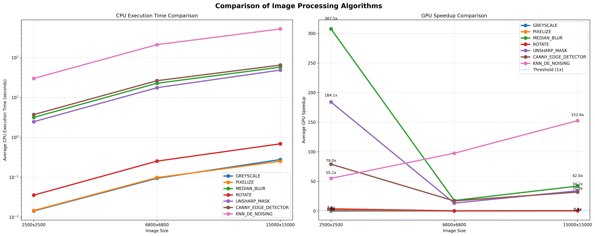

The chart highlights:

- **KNN denoising** dominates CPU time at large resolutions (hundreds of seconds at 15000²) while the GPU stays in the low seconds — largest **relative** wins for heavy neighborhood methods.
- **Median blur** and **unsharp mask** show strong GPU speedups at scale.
- **Grayscale**, **pixelize**, and **rotate** cluster near **1×** or **below** on GPU in these benchmarks (transfer and kernel overhead dominate).

### Per-algorithm plots

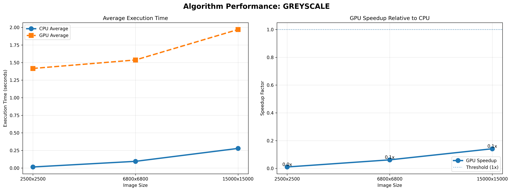

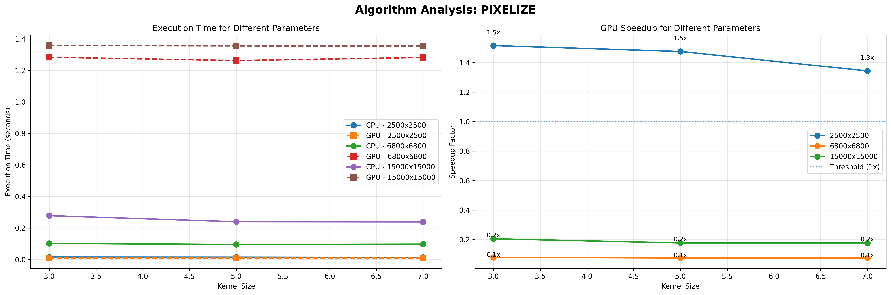

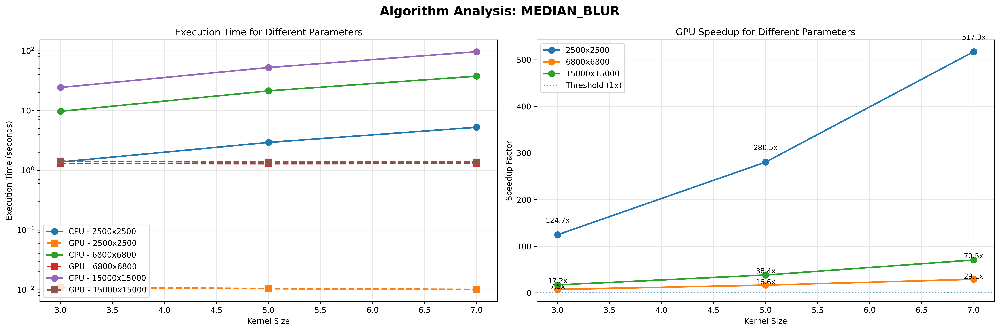

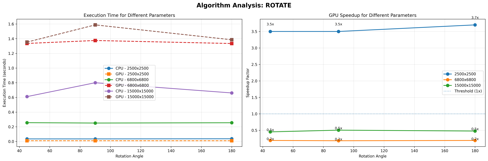

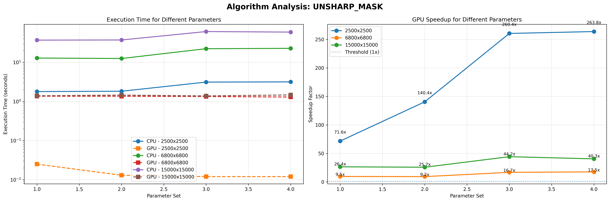

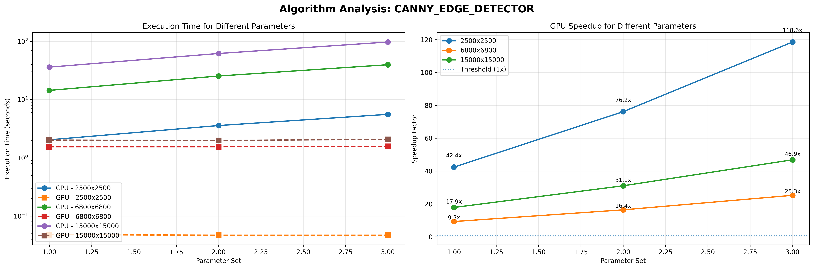

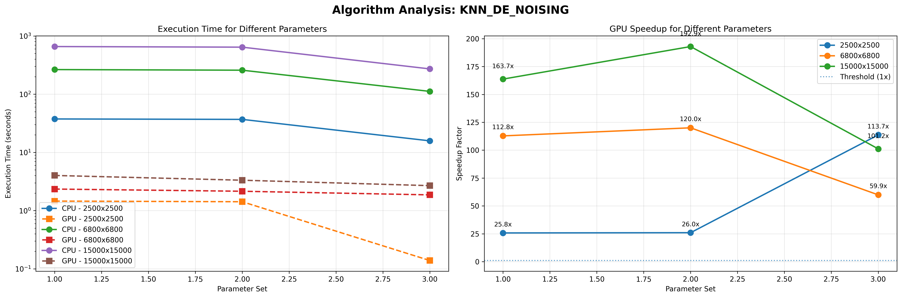

### Representative timings at **15000×15000**

Times are in **seconds**. **Speedup** = CPU ÷ GPU.

| Algorithm | Parameters (as in `res.txt`) | CPU [s] | GPU [s] | Speedup |
|-----------|------------------------------|--------:|--------:|--------:|
| GREYSCALE | — | 0.2783 | 1.9701 | 0.14× |
| PIXELIZE | block **5** | 0.2399 | 1.3561 | 0.18× |
| MEDIAN_BLUR | kernel **7** | 96.3370 | 1.3660 | **70.5×** |
| ROTATE | **90°** | 0.8000 | 1.5876 | 0.50× |
| UNSHARP_MASK | radius **5**, amount **2.0** | 59.2736 | 1.4690 | **40.3×** |
| CANNY_EDGE_DETECTOR | σ **2.0**, k **9**, tuple `(75,150)`† | 97.1320 | 2.0720 | **46.9×** |
| KNN_DE_NOISING | patch **3**, window **11**, **K=5** | 658.1960 | 4.0200 | **164×** |

### Spot checks at **2500×2500**

| Algorithm | Params | CPU [s] | GPU [s] | Speedup |
|-----------|--------|--------:|--------:|--------:|
| MEDIAN_BLUR | k=7 | 5.225 | 0.0101 | **517×** |
| UNSHARP_MASK | r=5, amt=2.0 | 3.1651 | 0.0120 | **264×** |
| CANNY_EDGE_DETECTOR | σ=2, k=9, tuple `(75,150)`† | 5.572 | 0.047 | **119×** |
| PIXELIZE | block 5 | 0.0149 | 0.0101 | **1.5×** |

---

## Visual demo

**Input:** [`images/image.png`](images/image.png) — **1200×630** RGB

Parameters used for the gallery:

| # | Output | Settings |
|---|--------|----------|
| 1 | [`docs/readme_samples/01_greyscale.png`](docs/results/01_greyscale.png) | Default grayscale |
| 2 | [`docs/readme_samples/02_pixelize.png`](docs/results/02_pixelize.png) | Block size **28** |
| 3 | [`docs/readme_samples/03_median_blur.png`](docs/results/03_median_blur.png) | Kernel **5×5** |
| 4 | [`docs/readme_samples/04_rotate_15deg.png`](docs/results/04_rotate_15deg.png) | **15°** CCW |
| 5 | [`docs/readme_samples/05_unsharp_mask.png`](docs/results/05_unsharp_mask.png) | Radius **2**, amount **1.5** |
| 6 | [`docs/readme_samples/06_canny_edges.png`](docs/results/06_canny_edges.png) | σ **1.0**, kernel **5**, threshold **100** |
| 7 | [`docs/readme_samples/07_knn_denoising.png`](docs/results/07_knn_denoising.png) | Patch **3**, window **11**, **K=5** |

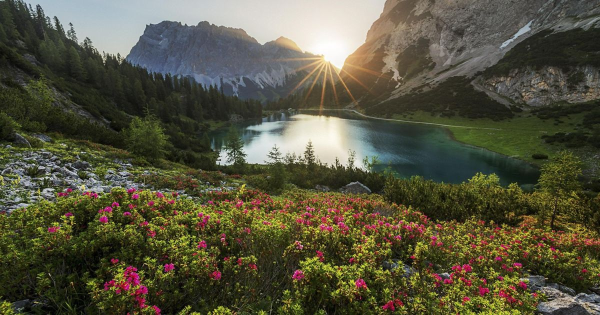

<p align="center"><em>Original</em></p>

<table>
<tr>
<td align="center"><strong>Grayscale</strong><br/>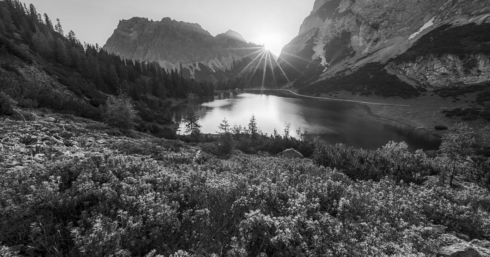</td>
<td align="center"><strong>Pixelize (28×28)</strong><br/></td>
</tr>
<tr>
<td align="center"><strong>Median blur (5×5)</strong><br/></td>
<td align="center"><strong>Rotate 15°</strong><br/>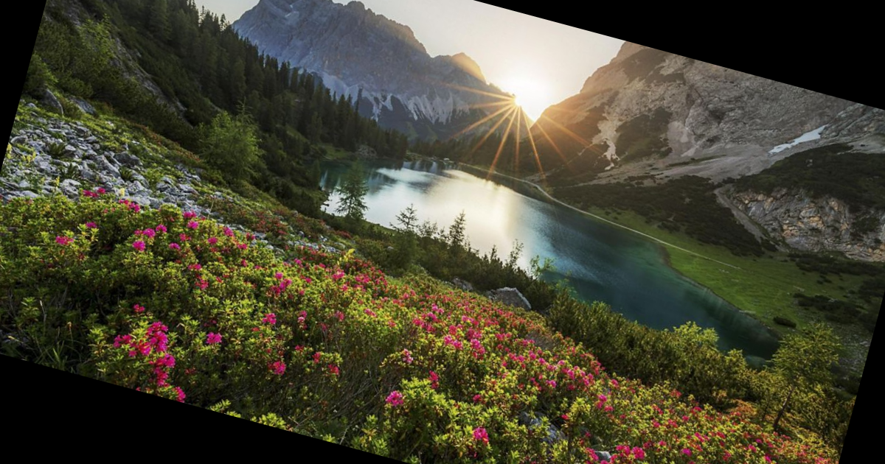</td>
</tr>
<tr>
<td align="center"><strong>Unsharp mask</strong><br/>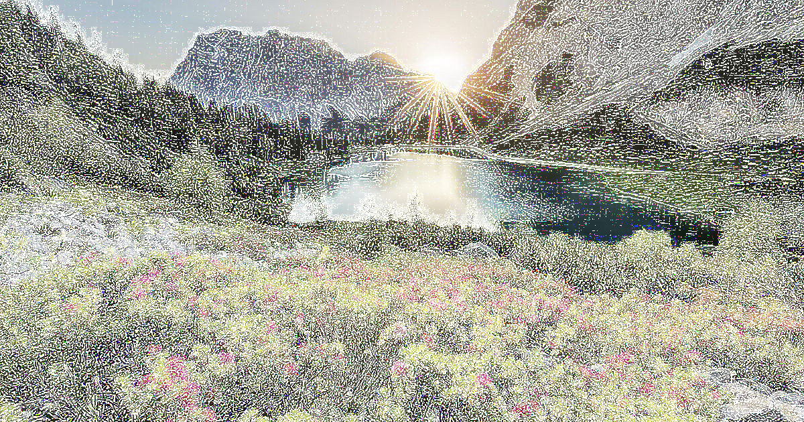</td>
<td align="center"><strong>Canny edges</strong><br/>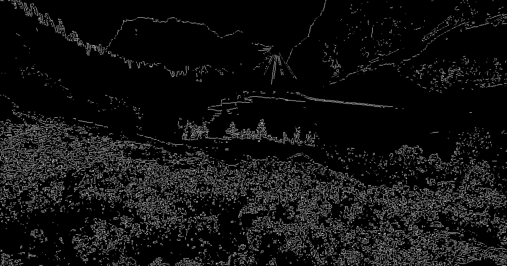</td>
</tr>
<tr>
<td align="center" colspan="2"><strong>KNN denoising</strong><br/></td>
</tr>
</table>

---